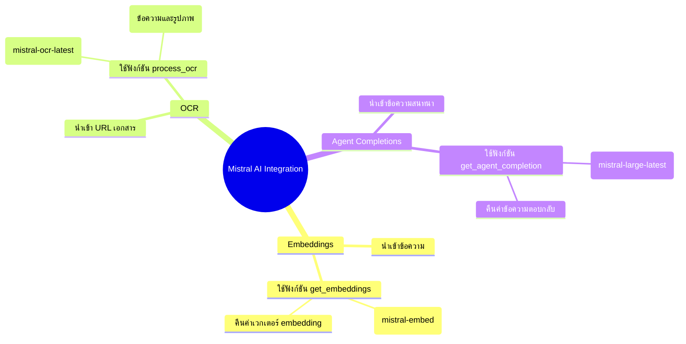
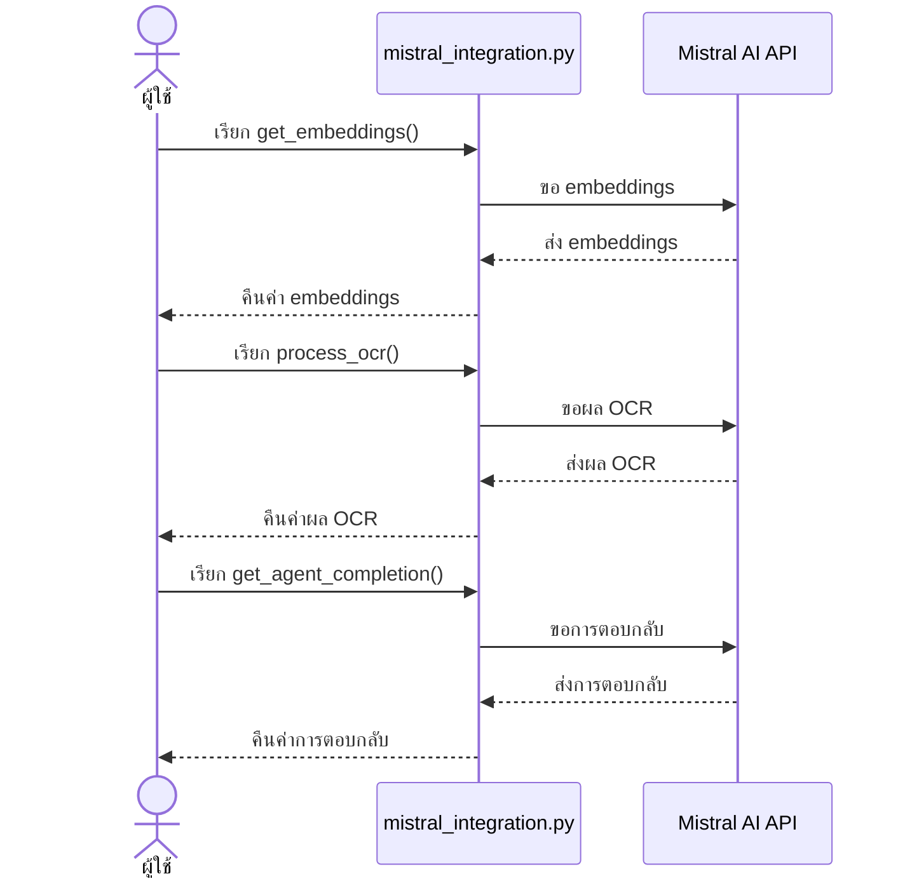
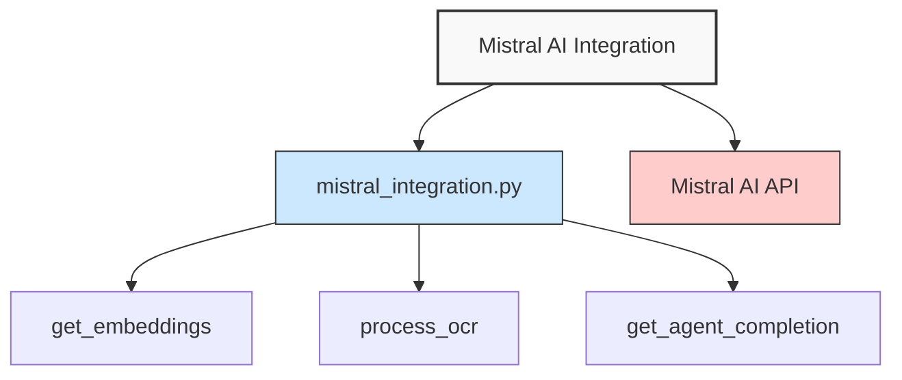

# Chain-of-Note RAG 🤖

[](https://opensource.org/licenses/MIT)
[](https://www.python.org/downloads/)
[](https://huggingface.co/)
[](https://mistral.ai/)


> 🌟 โปรเจกต์นี้เป็นการนำเสนอระบบ Retrieval-Augmented Generation (RAG) ที่ใช้เทคนิค Chain-of-Note เพื่อลดอาการ Hallucination ในการตอบสนองที่สร้างโดย AI

## 📑 สารบัญ
- [ภาพรวม](#-ภาพรวม)
- [คุณสมบัติ](#-คุณสมบัติ)
- [การติดตั้ง](#-การติดตั้ง)
- [การใช้งาน](#-การใช้งาน)
- [สถาปัตยกรรม](#-สถาปัตยกรรม)
- [Mistral AI Integration](#-mistral-ai-integration)
- [การประเมินผล](#-การประเมินผล)
- [เอกสารประกอบ](#-เอกสารประกอบ)
- [การอ้างอิง](#-การอ้างอิง)

## 🌟 ภาพรวม

Chain-of-Note RAG เป็นวิธีการขั้นสูงของ Retrieval-Augmented Generation ที่ช่วยลดอาการ Hallucination โดยการเพิ่มขั้นตอนการจดบันทึกระหว่างการดึงข้อมูลเอกสารและการสร้างคำตอบ

### ✨ ประโยชน์ของ Chain-of-Note

1. **🎯 ลดอาการ Hallucination**
   - บันทึกข้อเท็จจริงหลักจากเอกสาร
   - ลดโอกาสการสร้างข้อมูลที่ไม่ถูกต้อง

2. **📍 การระบุแหล่งที่มาที่ดีขึ้น**
   - ติดตามแหล่งที่มาของข้อมูล
   - เพิ่มความโปร่งใสและตรวจสอบได้

3. **🧠 การให้เหตุผลที่เพิ่มขึ้น**
   - แบ่งกระบวนการเป็นขั้นตอน
   - สร้างห่วงโซ่การให้เหตุผลที่แม่นยำ

## 🎯 คุณสมบัติ

### การทำงานหลัก
- 🔍 การทำดัชนีเอกสารด้วย Sentence Embeddings
- 📝 การสร้าง Chain-of-Note
- 🎯 ลดอาการ Hallucination
- 🤖 รองรับ Multiple Embedding Providers:
  - HuggingFace Models
  - Mistral AI API

### การประมวลผล
- 🚀 ประสิทธิภาพสูงด้วย Vector Search
- 📊 ระบบประเมินผลแบบครบวงจร
- 🔄 การประมวลผลแบบ Batch

## 📦 การติดตั้ง

```bash
# ติดตั้ง dependencies
pip install -r requirements.txt

# สำหรับการพัฒนา
pip install -e .
```

### การตั้งค่า API Keys
```bash
# สร้างไฟล์ .env
echo "HUGGINGFACE_TOKEN=your_token_here
MISTRAL_API_KEY=your_mistral_key_here" > .env
```

## 🚀 การใช้งาน

### การใช้งานพื้นฐาน
```python
from src.embeddings import SentenceTransformerEmbeddings, MistralEmbeddings
from src.rag_system import ChainOfNoteRAG

# เลือก Embedding Model (HuggingFace หรือ Mistral)
embedding_model = SentenceTransformerEmbeddings()  # หรือ MistralEmbeddings()
rag_system = ChainOfNoteRAG(embedding_model=embedding_model)

# ใช้งานระบบ
response = rag_system.query(
    "คำถามของคุณ",
    top_k=5,
    return_context=True,
    return_notes=True
)
```

### การใช้งานผ่าน Web Interface
```bash
python web.py
```

## 🏗 สถาปัตยกรรม

### องค์ประกอบหลัก
1. 📥 **Document Loader**
   - โหลดและแบ่งเอกสาร
   - รองรับหลายรูปแบบไฟล์

2. 🧮 **Embedding Models**
   - HuggingFace Models
   - Mistral AI API
   - รองรับการขยายเพิ่มเติม

3. 🗄️ **Document Store**
   - Vector Database
   - การค้นหาแบบมีประสิทธิภาพ

4. ⛓️ **Chain-of-Note**
   - การจดบันทึกอัตโนมัติ
   - การสร้างคำตอบที่แม่นยำ

## 🚀 Mistral AI Integration

ระบบได้รวมการทำงานกับ Mistral AI API เพื่อเพิ่มความสามารถในการประมวลผลภาษาธรรมชาติ:

### แผนภาพการทำงาน


### โครงสร้างการทำงาน
```mermaid
flowchart TB
    subgraph ผู้ใช้งาน
        UI[โค้ดหรือผู้ใช้]
    end

    subgraph การเชื่อมต่อ_Mistral_AI
        API[mistral_integration.py]
    end
    
    subgraph ภายนอก
        MAPI[Mistral AI API]
    end
    
    UI -->|เรียกใช้ฟังก์ชัน| API
    API -->|ส่งคำขอ API| MAPI
    MAPI -->|ส่งผลลัพธ์| API
    
    classDef user fill:#f9d3a7,stroke:#333,stroke-width:1px
    classDef integration fill:#a7c7f9,stroke:#333,stroke-width:1px
    classDef external fill:#f9a7a7,stroke:#333,stroke-width:1px

    class ผู้ใช้งาน user
    class การเชื่อมต่อ_Mistral_AI integration
    class ภายนอก external
```

### ลำดับการทำงาน


### องค์ประกอบระบบ


### หลักการทำงาน
- **การแบ่งโมดูล:** แยกฟังก์ชันการทำงานเป็นส่วนๆ ตามการใช้งาน API
- **การจัดการความปลอดภัย:** เก็บ API key ในตัวแปรแวดล้อม
- **การจัดการข้อผิดพลาด:** มีระบบตรวจจับและรายงานข้อผิดพลาด
- **การขยายระบบ:** สามารถเพิ่มฟังก์ชันการทำงานได้ง่าย

## 📊 การประเมินผล

### ตัวชี้วัดหลัก
- 📉 คะแนน Hallucination
- 🎯 ความเกี่ยวข้องของคำตอบ
- 📈 คะแนน ROUGE
- 🔄 การเปรียบเทียบกับ RAG มาตรฐาน

## 📚 เอกสารประกอบ

- [🔍 คู่มือการใช้งานระบบ Embeddings](docs/thai_embeddings_guide.md)
- [🏗 สถาปัตยกรรมระบบ RAG](docs/thai_rag_architecture.md)
- [📝 ตัวอย่างการใช้งาน](docs/thai_usage_examples.md)
- [📖 API Reference](docs/api_reference.md)
- [📋 Changelog](docs/CHANGELOG.md)

## 📜 การอ้างอิง

```bibtex
@software{chain_of_note_rag,
  author = {zombitx64},
  title = {Chain-of-Note RAG System},
  year = {2023},
  url = {https://github.com/JonusNattapong/Chain-of-Note}
}
```

## 📄 สิทธิ์การใช้งาน

โปรเจกต์นี้ได้รับอนุญาตภายใต้ [MIT License](LICENSE)

---
<div align="center">
  <sub>Built with ❤️ by zombitx64</sub>
</div>
