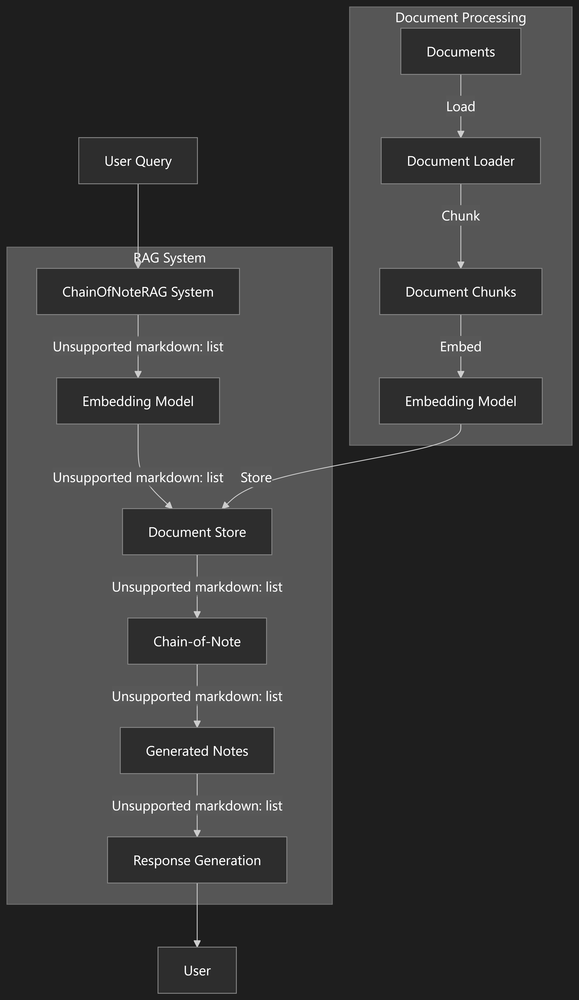

# Chain-of-Note RAG System

This project implements a Retrieval-Augmented Generation (RAG) system that uses the Chain-of-Note technique to reduce hallucinations in AI-generated responses.

## Overview

Chain-of-Note RAG is an enhanced approach to Retrieval-Augmented Generation that significantly reduces hallucinations by introducing an intermediate note-taking step between document retrieval and answer generation. The system first generates detailed notes from retrieved documents, then uses those notes to craft accurate responses.

### Benefits of Chain-of-Note over Traditional RAG:

1.  **Reduced Hallucinations**: By explicitly capturing key facts from retrieved documents in intermediate notes, the model is less likely to generate incorrect information.
2.  **Improved Attribution**: The note-taking step helps track the source of information, making the system's answers more transparent and verifiable.
3.  **Enhanced Reasoning**: Breaking the process into retrieval → note-taking → answer generation creates a step-by-step reasoning chain that produces more accurate results.

## Features

-   Document indexing and retrieval using sentence embeddings
-   Chain-of-Note generation for improved reasoning
-   Reduction of hallucinations through note-based context augmentation
-   Integration with Hugging Face models
-   Comprehensive evaluation metrics to compare performance with standard RAG

## Installation

```bash
pip install -r requirements.txt
```

For development installation:

```bash
pip install -e .
```

## Usage

### Quick Start

```python
from src.data_loader import DocumentLoader
from src.embeddings import SentenceTransformerEmbeddings
from src.rag_system import ChainOfNoteRAG

# 1. Initialize the RAG system
embedding_model = SentenceTransformerEmbeddings()
rag_system = ChainOfNoteRAG(embedding_model=embedding_model)

# 2. Load documents
loader = DocumentLoader()
loader.load_text("Your document content here", {"source": "Example"})
rag_system.process_documents_from_loader(loader)

# 3. Query the system
response = rag_system.query(
    "Your question here",
    top_k=5,
    return_context=True,
    return_notes=True
)

# 4. Access the results
notes = response["notes"]
answer = response["answer"]
context = response["context"]
```

### Examples

The project includes several examples:

1.  **Basic Demo**: `examples/demo.py` - Demonstrates the core functionality with sample data
2.  **RAG Comparison**: `examples/comparison.py` - Compares standard RAG with Chain-of-Note RAG
3.  **Real-world Example**: `examples/real_world_example.py` - Uses Wikipedia data to showcase real-world application

## Architecture

The system consists of several key components:

1.  **Document Loader**: Handles loading and chunking of documents
2.  **Embedding Model**: Creates vector representations of documents and queries
3.  **Document Store**: Vector database for efficient document retrieval
4.  **Chain-of-Note**: Implements the note-taking and answer generation process
5.  **RAG System**: Orchestrates the entire process from query to response

### System Diagram



### แผนภาพระบบ (Thai Translation)


## Evaluation

The system includes an evaluation module that measures:

-   Hallucination scores based on n-gram overlap
-   Relevance of answers to queries
-   ROUGE scores for answer quality
-   Comparative metrics between standard RAG and Chain-of-Note RAG

## Citation

If you use this code in your research, please cite:

```
@software{chain_of_note_rag,
  author = {zombitx64},
  title = {Chain-of-Note RAG System},
  year = {2023},
  url = {https://github.com/example/chain-of-note-rag}
}
```

## License

This project is licensed under the MIT License - see the LICENSE file for details.

## Thai Translation (การแปลภาษาไทย)

# ระบบ Chain-of-Note RAG

โปรเจกต์นี้เป็นการนำเสนอระบบ Retrieval-Augmented Generation (RAG) ที่ใช้เทคนิค Chain-of-Note เพื่อลดอาการ Hallucination ในการตอบสนองที่สร้างโดย AI

## ภาพรวม

Chain-of-Note RAG เป็นวิธีการขั้นสูงของ Retrieval-Augmented Generation ที่ช่วยลดอาการ Hallucination ได้อย่างมาก โดยการเพิ่มขั้นตอนการจดบันทึกระหว่างการดึงข้อมูลเอกสารและการสร้างคำตอบ ระบบจะสร้างบันทึกรายละเอียดจากเอกสารที่ดึงมาก่อน จากนั้นจึงใช้บันทึกเหล่านั้นเพื่อสร้างคำตอบที่ถูกต้อง

### ประโยชน์ของ Chain-of-Note เหนือกว่า RAG แบบดั้งเดิม:

1.  **ลดอาการ Hallucination**: โดยการบันทึกข้อเท็จจริงหลักจากเอกสารที่ดึงมาในบันทึก இடைநிலை โมเดลมีโอกาสน้อยที่จะสร้างข้อมูลที่ไม่ถูกต้อง
2.  **การระบุแหล่งที่มาที่ดีขึ้น**: ขั้นตอนการจดบันทึกช่วยติดตามแหล่งที่มาของข้อมูล ทำให้คำตอบของระบบมีความโปร่งใสและตรวจสอบได้มากขึ้น
3.  **การให้เหตุผลที่เพิ่มขึ้น**: การแบ่งกระบวนการออกเป็นการดึงข้อมูล → การจดบันทึก → การสร้างคำตอบ จะสร้างห่วงโซ่การให้เหตุผลทีละขั้นตอนที่ให้ผลลัพธ์ที่แม่นยำยิ่งขึ้น

## คุณสมบัติ

-   การทำดัชนีเอกสารและการดึงข้อมูลโดยใช้ Sentence Embeddings
-   การสร้าง Chain-of-Note เพื่อการให้เหตุผลที่ดีขึ้น
-   ลดอาการ Hallucination ผ่านการเพิ่มบริบทจากบันทึก
-   การผสานรวมกับ Hugging Face Models
-   ตัวชี้วัดการประเมินที่ครอบคลุมเพื่อเปรียบเทียบประสิทธิภาพกับ RAG มาตรฐาน

## การติดตั้ง

```bash
pip install -r requirements.txt
```

สำหรับการติดตั้งเพื่อการพัฒนา:

```bash
pip install -e .
```

## การใช้งาน

### เริ่มต้นอย่างรวดเร็ว

```python
from src.data_loader import DocumentLoader
from src.embeddings import SentenceTransformerEmbeddings
from src.rag_system import ChainOfNoteRAG

# 1. เริ่มต้นระบบ RAG
embedding_model = SentenceTransformerEmbeddings()
rag_system = ChainOfNoteRAG(embedding_model=embedding_model)

# 2. โหลดเอกสาร
loader = DocumentLoader()
loader.load_text("เนื้อหาเอกสารของคุณที่นี่", {"source": "ตัวอย่าง"})
rag_system.process_documents_from_loader(loader)

# 3. สอบถามระบบ
response = rag_system.query(
    "คำถามของคุณที่นี่",
    top_k=5,
    return_context=True,
    return_notes=True
)

# 4. เข้าถึงผลลัพธ์
notes = response["notes"]
answer = response["answer"]
context = response["context"]
```

### ตัวอย่าง

โปรเจกต์นี้มีตัวอย่างหลายตัวอย่าง:

1.  **การสาธิตพื้นฐาน**: `examples/demo.py` - สาธิตฟังก์ชันหลักด้วยข้อมูลตัวอย่าง
2.  **การเปรียบเทียบ RAG**: `examples/comparison.py` - เปรียบเทียบ RAG มาตรฐานกับ Chain-of-Note RAG
3.  **ตัวอย่างการใช้งานจริง**: `examples/real_world_example.py` - ใช้ข้อมูล Wikipedia เพื่อแสดงการใช้งานจริง

## สถาปัตยกรรม

ระบบประกอบด้วยองค์ประกอบหลักหลายส่วน:

1.  **Document Loader**: จัดการการโหลดและการแบ่งเอกสารออกเป็นส่วนๆ
2.  **Embedding Model**: สร้างเวกเตอร์แทนเอกสารและคำถาม
3.  **Document Store**: ฐานข้อมูลเวกเตอร์สำหรับการดึงเอกสารอย่างมีประสิทธิภาพ
4.  **Chain-of-Note**: ใช้กระบวนการจดบันทึกและสร้างคำตอบ
5.  **RAG System**: ประสานงานกระบวนการทั้งหมดตั้งแต่คำถามจนถึงคำตอบ

### แผนภาพระบบ


## การประเมินผล

ระบบมีโมดูลการประเมินที่วัด:

-   คะแนน Hallucination ตาม n-gram overlap
-   ความเกี่ยวข้องของคำตอบกับคำถาม
-   คะแนน ROUGE สำหรับคุณภาพของคำตอบ
-   ตัวชี้วัดเปรียบเทียบระหว่าง RAG มาตรฐานและ Chain-of-Note RAG

## การอ้างอิง

หากคุณใช้โค้ดนี้ในงานวิจัยของคุณ โปรดอ้างอิง:

```
@software{chain_of_note_rag,
  author = {zombitx64},
  title = {Chain-of-Note RAG System},
  year = {2023},
  url = {https://github.com/example/chain-of-note-rag}
}
```

## สิทธิ์การใช้งาน

โปรเจกต์นี้ได้รับอนุญาตภายใต้ MIT License - ดูรายละเอียดได้ที่ไฟล์ LICENSE