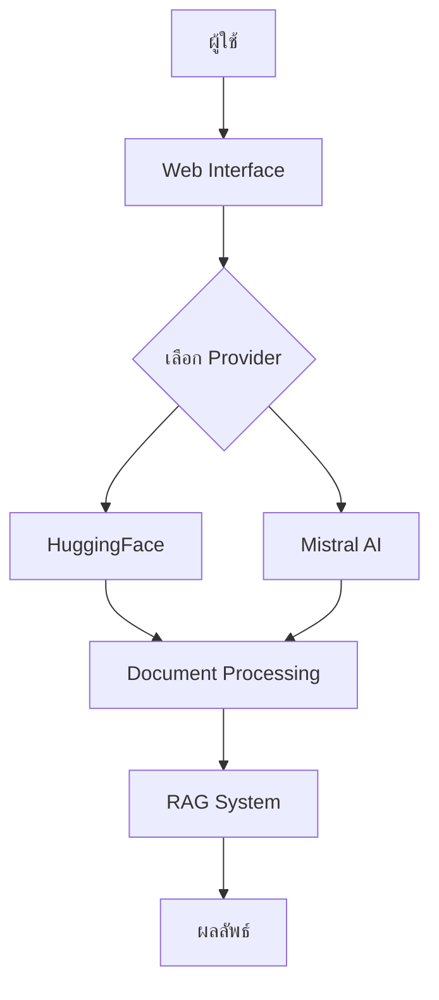

# สถาปัตยกรรมระบบ RAG (Retrieval-Augmented Generation)

## โครงสร้างหลักของระบบ

### 1. ภาพรวมระบบ
```
Chain-of-Note/
├── src/
│   ├── embeddings.py       # โมดูลจัดการ embeddings
│   ├── rag_system.py      # ระบบ RAG หลัก
│   ├── chain_of_note.py   # การประมวลผล Chain-of-Note
│   ├── document_store.py  # การจัดเก็บเอกสาร
│   └── evaluation.py      # การประเมินผล
├── web.py                 # เว็บแอปพลิเคชัน
└── examples/              # ตัวอย่างการใช้งาน
```

### 2. การทำงานของระบบ

#### 2.1 ขั้นตอนการทำงาน
1. รับข้อมูลเอกสาร
2. สร้าง embeddings
3. จัดเก็บในฐานข้อมูล
4. รับคำถาม
5. ค้นหาเอกสารที่เกี่ยวข้อง
6. สร้างคำตอบ

#### 2.2 การทำงานร่วมกับ API


## การจัดการ Embeddings

### 1. HuggingFace Embeddings
- ใช้ Sentence Transformers
- รองรับหลายภาษา
- สามารถทำงานแบบ offline ได้
- เหมาะสำหรับการพัฒนาและทดสอบ

### 2. Mistral AI Embeddings
- ใช้ API ของ Mistral
- ประสิทธิภาพสูง
- เหมาะสำหรับการใช้งานจริง
- ต้องการการเชื่อมต่ออินเทอร์เน็ต

### 3. การผสมผสานระบบ
```python
class ChainOfNoteRAG:
    def __init__(self, embedding_model, chain_of_note=None):
        self.embedding_model = embedding_model
        self.document_store = DocumentStore()
        self.chain_of_note = chain_of_note or ChainOfNote()
```

## การปรับแต่งและพัฒนา

### 1. การเพิ่มประสิทธิภาพ

#### 1.1 การ Caching
```python
class CachedEmbeddings:
    def __init__(self, base_embeddings, cache_dir="./cache"):
        self.base_embeddings = base_embeddings
        self.cache_dir = cache_dir
```

#### 1.2 การ Batching
```python
def process_in_batches(documents, batch_size=32):
    for i in range(0, len(documents), batch_size):
        batch = documents[i:i + batch_size]
        yield batch
```

### 2. การปรับแต่งพารามิเตอร์

#### 2.1 ค่าพื้นฐาน
```python
DEFAULT_CONFIG = {
    "chunk_size": 300,
    "chunk_overlap": 50,
    "top_k": 3,
    "similarity_threshold": 0.7
}
```

#### 2.2 การปรับแต่งตามการใช้งาน
- ปรับขนาด chunk ตามลักษณะเอกสาร
- ปรับค่า top_k ตามความต้องการ
- ตั้งค่า threshold ตามความแม่นยำที่ต้องการ

## การวิเคราะห์และประเมินผล

### 1. ตัวชี้วัดประสิทธิภาพ

#### 1.1 ความแม่นยำ
```python
def evaluate_accuracy(predictions, ground_truth):
    correct = sum(p == t for p, t in zip(predictions, ground_truth))
    return correct / len(predictions)
```

#### 1.2 ความเร็ว
```python
def measure_latency(func):
    def wrapper(*args, **kwargs):
        start = time.time()
        result = func(*args, **kwargs)
        end = time.time()
        return result, end - start
    return wrapper
```

### 2. การเปรียบเทียบโมเดล

#### 2.1 ตารางเปรียบเทียบ
| คุณสมบัติ | HuggingFace | Mistral AI |
|----------|-------------|------------|
| ความแม่นยำ | ดี | ดีมาก |
| ความเร็ว | ปานกลาง | เร็ว |
| การใช้ทรัพยากร | สูง | ต่ำ |
| ค่าใช้จ่าย | ฟรี/ต่ำ | ตามการใช้งาน |

## แนวทางการพัฒนาต่อ

### 1. การเพิ่มความสามารถ
- รองรับภาษาเพิ่มเติม
- เพิ่ม embedding providers
- ปรับปรุงการจัดการ context

### 2. การปรับปรุงประสิทธิภาพ
- พัฒนาระบบ caching
- เพิ่มประสิทธิภาพการค้นหา
- ลดการใช้ทรัพยากร

### 3. การประยุกต์ใช้งาน
- ระบบตอบคำถามอัตโนมัติ
- ระบบแนะนำเอกสาร
- การวิเคราะห์ข้อมูลขนาดใหญ่

## การแก้ไขปัญหาที่พบบ่อย

### 1. ปัญหาการเชื่อมต่อ API
- ตรวจสอบ API token
- ตรวจสอบการเชื่อมต่อ
- มีระบบ retry และ fallback

### 2. ปัญหาประสิทธิภาพ
- ปรับขนาด batch
- ใช้ caching
- ตรวจสอบการใช้หน่วยความจำ

### 3. ปัญหาความแม่นยำ
- ปรับค่า similarity threshold
- เพิ่มจำนวนเอกสารอ้างอิง
- ปรับปรุงการประมวลผลภาษา

## การดูแลรักษาระบบ

### 1. การสำรองข้อมูล
- สำรอง embeddings
- สำรองค่าพารามิเตอร์
- สำรองฐานข้อมูลเอกสาร

### 2. การติดตามประสิทธิภาพ
- บันทึกการใช้งาน API
- ติดตามการใช้ทรัพยากร
- วิเคราะห์ความแม่นยำ

### 3. การอัพเดทระบบ
- ติดตามเวอร์ชันใหม่ของ API
- อัพเดทไลบรารี
- ทดสอบการทำงานหลังอัพเดท