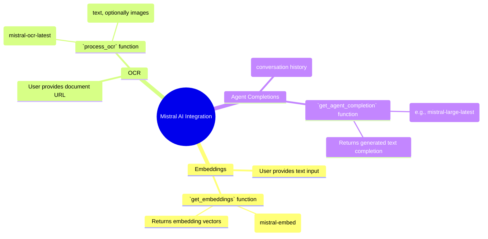
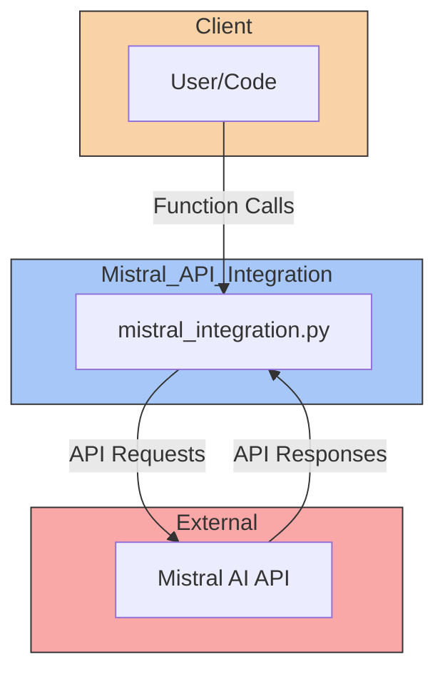
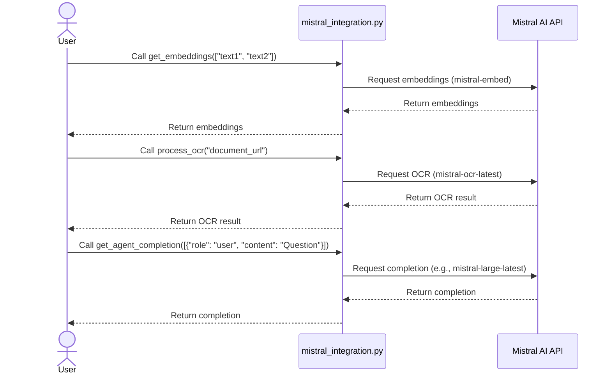
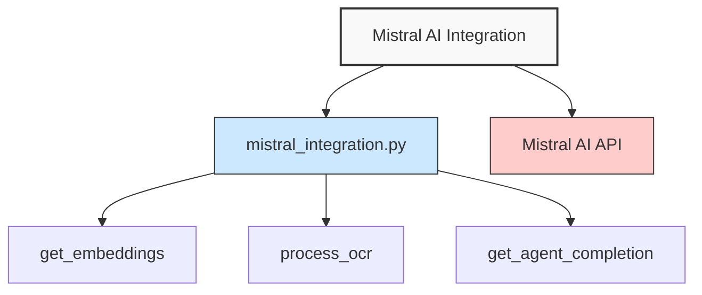

# Mistral AI Integration

This project provides a simple integration with the Mistral AI API, allowing you to utilize its capabilities for:

*   **Text Embeddings:** Generate vector representations of text.
*   **Optical Character Recognition (OCR):** Extract text from documents (e.g., PDFs).
*   **Agent Completions:** Interact with Mistral AI's language models for text generation and Q&A.

## Prerequisites

*   A Mistral AI API key. Obtain one from [Mistral AI](https://mistral.ai/).
*   Python 3.7+
*   The `mistralai` Python package: `pip install mistralai`

## API Key Setup

Before running the code, you **must** set the `MISTRAL_API_KEY` environment variable.  This is how the code authenticates with the Mistral AI API.

**Instructions:**

*   **Windows (Command Prompt):**
    ```
    set MISTRAL_API_KEY=your_api_key
    ```

*   **Windows (PowerShell):**
    ```powershell
    $env:MISTRAL_API_KEY = "your_api_key"
    ```

*   **macOS/Linux:**
    ```bash
    export MISTRAL_API_KEY=your_api_key
    ```

Replace `"your_api_key"` with your actual Mistral API key.

## Usage

The `mistral_integration.py` file contains three main functions:

1.  `get_embeddings(texts)`:
    *   Takes a list of strings (`texts`).
    *   Returns a list of embedding vectors from the Mistral AI API.
    *   Example:
        ```python
        texts = ["Hello", "World"]
        embeddings = get_embeddings(texts)
        print(embeddings)
        ```

2.  `process_ocr(document_url, include_image_base64=True)`:
    *   Takes a document URL (`document_url`) and an optional boolean to include base64 encoded images (`include_image_base64`).
    *   Returns the OCR result from the Mistral AI API.
    *   Example:
        ```python
        document_url = "https://example.com/document.pdf"
        ocr_result = process_ocr(document_url)
        print(ocr_result)
        ```

3.  `get_agent_completion(messages, max_tokens=100, model="mistral-large-latest")`:
    *    Takes a list of messages (`messages`), optional `max_tokens`, and the model name (`model`).
    *   Returns the completion generated by the Mistral AI agent.
    *   Example:
        ```python
        messages = [{"role": "user", "content": "What is the capital of France?"}]
        completion = get_agent_completion(messages)
        print(completion)
        ```

To run the examples, execute the script: `python mistral_integration.py`.  Make sure you've set the `MISTRAL_API_KEY` environment variable first.

## Workflow Diagram (Mindmap)



## Architecture Diagram



## Data Flow Sequence



## Component Hierarchy


## Principles

*   **Modularity:** The code is organized into functions for each core API interaction (embeddings, OCR, agent completions). This makes it easy to use and extend.
*   **Error Handling:**  Basic error handling is included (checking for the API key and catching exceptions during API calls).  More robust error handling could be added.
*   **API Key Security:** The API key is *not* hardcoded. It's read from an environment variable, which is a more secure practice.
*   **Dependency Management:** The required `mistralai` package is specified, making it easy to install.
* **Clear separation of concerns:** Each function has a single, well-defined purpose.

## Further Improvements

*   **More robust error handling:** Implement more specific error handling and retry mechanisms.
*   **Asynchronous operations:** Use asynchronous requests (e.g., with `asyncio`) for improved performance, especially when processing multiple inputs.
*   **Configuration options:** Allow users to configure the model, maximum tokens, and other parameters more easily (e.g., through command-line arguments or a configuration file).
*   **Input validation:** Add validation for input parameters (e.g., checking the format of the document URL).
*   **Integration with other systems:**  This code could be integrated into a larger application, such as a document processing pipeline or a chatbot.

> Note: To properly view these diagrams, you need to render this markdown file in an environment that supports Mermaid diagrams (like GitHub, GitLab, or VS Code with the Markdown Preview Enhanced extension).

## Last Updated: 2025-03-18